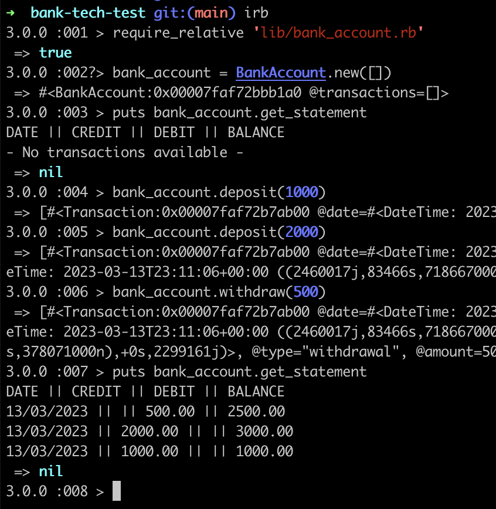
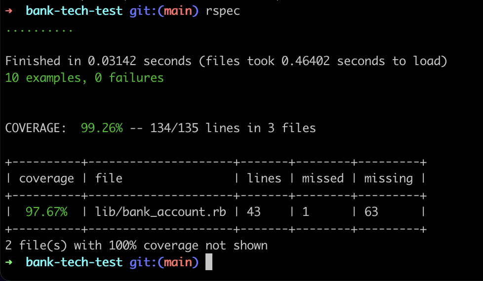
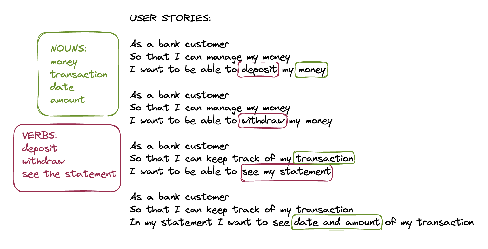
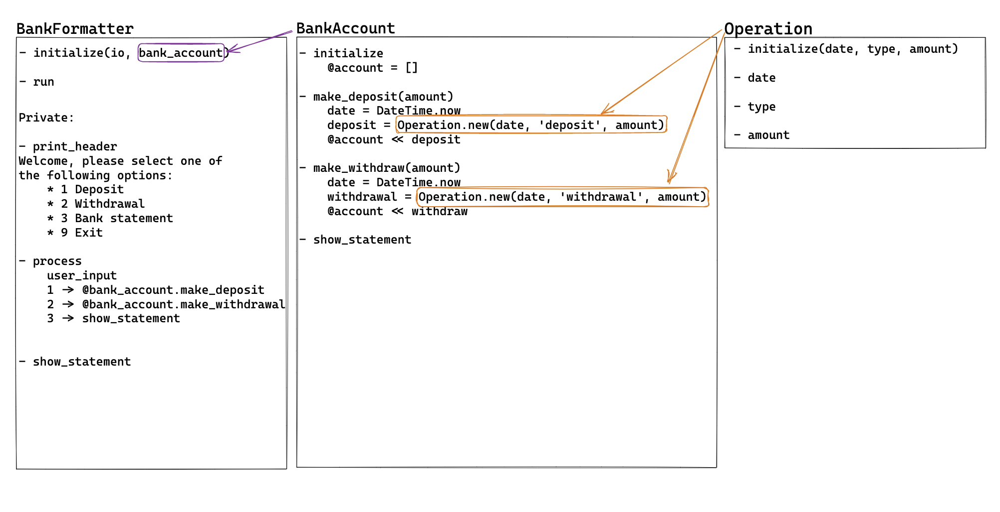

# Bank tech test

## Specification

This is a simple bank program, created with Ruby, that allows the users to do deposits and withdrawals.
It also allows the users to see their account statements (Transaction date, transaction amount and total balance) with transactions in reverse chronological order.

It is possible to interact with the program via Ruby's shell, IRB.

## Technologies used

| Technology               | Name               |     |
| ------------------------ | ------------------ | --- |
| **Programming Language** | Ruby               |  <code></code>   |
| **Test**                 | RSpec              | <code></code> |
| **Text Editor**          | Visual Studio Code |   <code></code>  |

## How to run the program

Before running this program make sure you have Ruby installed on your machine by typing in your terminal:

`ruby -v`

Otherwise you can install it by following the instructions reported [on the Ruby website](https://www.ruby-lang.org/en/documentation/installation/)

Once you have done it, you can interact with the program via IRB by simply typing on the terminal:

`irb`

Here is an example on how you can do it from the root directory of the project:

<!--  -->


### Example usage

``` ruby
require_relative 'lib/bank_account.rb'

bank_account = BankAccount.new([])

puts bank_account.get_statement

# Output:

'DATE || CREDIT || DEBIT || BALANCE'
'- No transactions available -'

bank_account.deposit(1000)
bank_account.deposit(2000)
bank_account.withdraw(500)

puts bank_account.get_statement

# Output:

'DATE || CREDIT || DEBIT || BALANCE'
'14/03/2023 || || 500.00 || 2500.00'
'14/03/2023 || 2000.00 || || 3000.00'
'14/03/2023 || 1000.00 || || 1000.00'
```

## Testing

To run the tests it will be necessary to install rspec by typing on your console:

```
gem install bundler
bundle add rspec
```

then you can run the tests by typing:

`rspec`

from the root directory of the project.



## My approach to the problem

I started approaching my problem creating some user stories and highlighting the relevant nouns and verbs.



I then created a diagram with the classes and their methods.



## Code structure

As you can see from the diagram above, I thought to create a BankAccount class that is initialised with an empty array, it creates Transaction objects that are then stored in the array. Once the bank statement is requested, BankAccount iterates through the array of Transaction objects to access the date, the amount, the type and from it calculates a balance. The statement is then returned with transactions in reverse chronological order.

## Work in progress

As I first designed my app, I included an extra interface class to allow the program to be run from the command line.
Unfortunately, as the time was running out and the deadline was approaching the class wasn't working as I would have liked to and therefore I decided to remove it to continue to work on that as soon as I'll have the chance.
